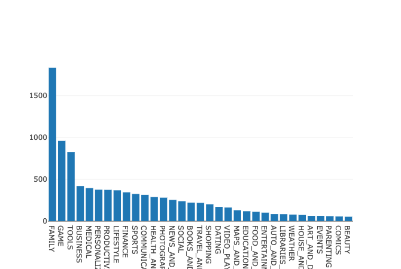
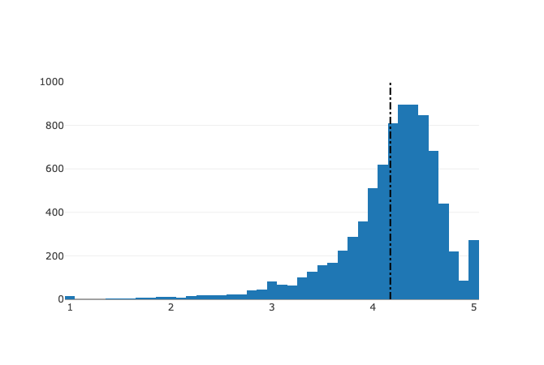
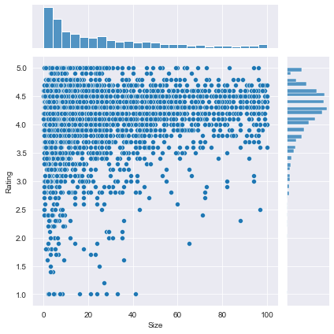
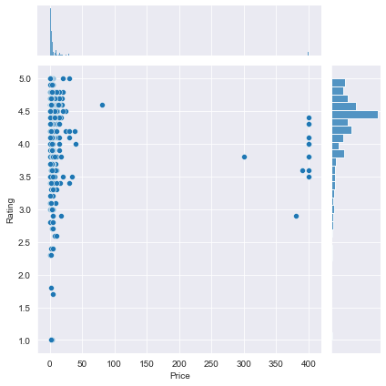
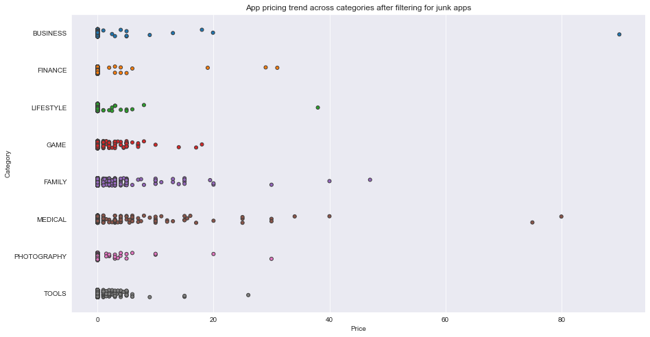
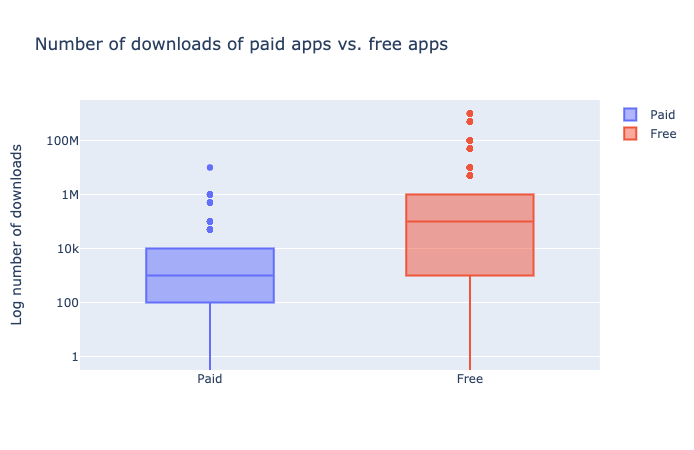
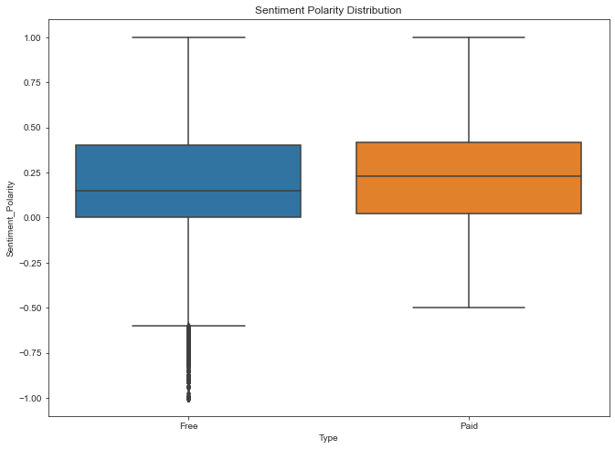

# 🎥 Google Play Store Apps and Reviews 
Simple data science project that do analysis of the Android app market by comparing over ten thousand apps in Google Play across different categories.
 
Get insights in the data to devise strategies to drive growth and retention.

## 🤔 How to use this project

To get started just open the notebook.ipynb using jupyter notebook or any other equivalent

NOTE: You need to also download the datasets folder in order for project to work 

## 💁 What You're Getting
```bash
├── notebook.ipynb
├── datasets folder
```

## 📸 Visualizations from the Project

###### Categories and their Valeus


<br/>

###### Distribution - Average app rating


<br/>

###### Size vs Rating of App


<br/>

###### Price vs Rating of App


<br/>

###### App pricing trend across categories


<br/>

###### App pricing trend across categories after filtering for junk apps


<br/>

###### Number of downloads of paid apps vs. free apps


<br/>

###### Sentiment Polarity Distribution


<br/>

